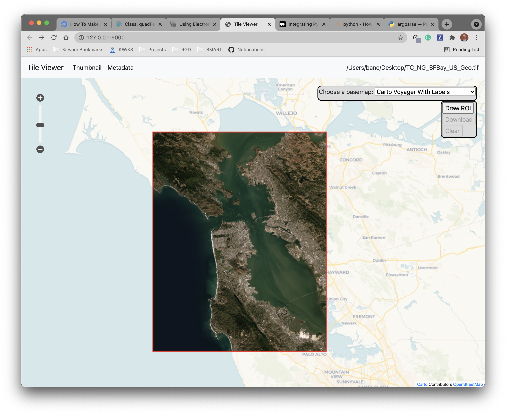

# Local Tile Server

This is a simple Flask application for serving raster image tiles locally in the OGC standard. on a geospatial map.

This uses `large_image` and GeoJS for the viewer included with the
application.

You can use this application to select and extract regions of interest from rasters.




## Usage

```bash
python -m tileserver path/to/raster.tif
```

## Electron App

(Work in progress...)


## Using with ipyleaflet

There are utilities included here for launching a tile server as a background thread to serve image tiles from any raster file on your
local file system. Further, I have inlcuded a utility for
automatically launching a tile server and creating an
`ipyleaflet.TileLayer`. Here is an example:

```py
from tileserver import get_leaflet_tile_layer
from ipyleaflet import Map, projections, ScaleControl, FullScreenControl, SplitMapControl

m = Map(
        center=(37.7249511580583, -122.27230466902257),
        zoom=9, crs=projections.EPSG3857,
       )

# Create two tile layers from 2 seperate raster files
l = get_leaflet_tile_layer('~/Desktop/TC_NG_SFBay_US_Geo.tif',
                           band=1, palette='matplotlib.Viridis_20', vmin=50, vmax=200)
r = get_leaflet_tile_layer('~/Desktop/small.tif',
                           band=2, palette='matplotlib.Plasma_6', vmin=0, vmax=150)

control = SplitMapControl(left_layer=l, right_layer=r)
m.add_control(control)

m.add_control(ScaleControl(position='bottomleft'))
m.add_control(FullScreenControl())
m
```


